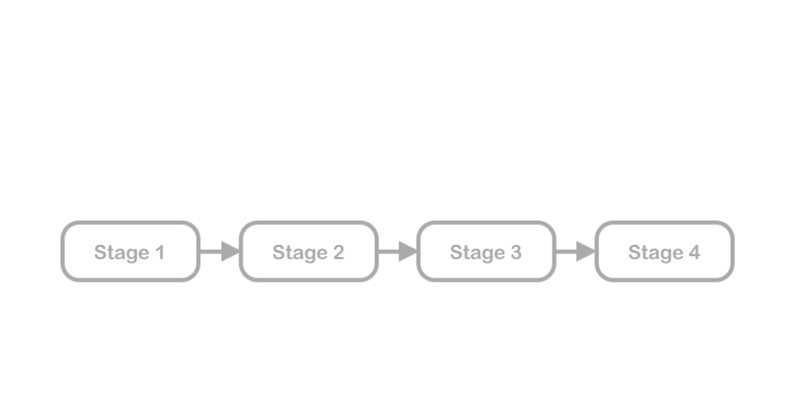
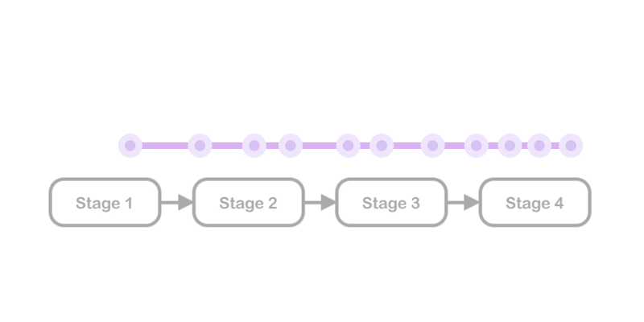

After having discussed some thoughts on [Teaching Concepts via Project-driven Motivation](/2019/04/25/teaching-with-project-driven-motivation.html), we can now talk about how to go about implementing a system that given the data, does this for us, through a popular approach.

<!--more-->

Continuing from course stages, here’s a typical flow.

*Stages in a course fulfilling a technology or a project*

Stimulating the right thoughts is a point to inculcate independent learning. To spark self-interest, we’ve talked about **motivation fuel**: curiosity initiators that encourage a learner to explore a given concept further. They could take forms of an insightful question, tidbits or a resource, and could be sent/triggered at various points.

*Motivating micro-posts*

They could also target various disciplines, without overpowering the actual course.

*They’re like sidequests in a game, but arguably much more important.*

Given that we invest in **auto-tagging links** as discussed, and every link is tagged in multiple ways, this is greatly simplified. Here’s an approach I worked on for it as a [Github Gist](https://gist.github.com/pratu16x7/b7f834a0eb14df721ff3d2d57f135b7d).

This becomes even better if these could be linked to some **reward.** While this could mean raw stats, we could also link some of these to prove helpful in further points in the course to drive home the **relevance** in a concrete way.

*Future Relevance. Needs quite a bit of planning.*

All these ideas come partly under the broad and widely applied umbrella of [**Gamification**](https://en.wikipedia.org/wiki/Gamification) (which implements various forms of points and reward systems like *earning badges*, akin to a game, to keep users involved). However, in a learning context, it is more beneficial if the rewards are not simply metaphorical but a tangible fruit for unconventional, purely curiosity-driven tasks.

While students receive these updates on the learning side, the educators will also need updates on a student’s progress.

This is done through **automated progress tracking.** The measures that are tracked as indicators of progress have to be tuned based on the course. For example, rather than the number of problems solved, the could rate the quality of the solution and the time taken. 

----

*These are just some of the potential instigators to keep up the most important driving force of learning apart from innate curiosity: **motivation**. The realm of gamifiation explores this in further detail, and with much grounded research.*

