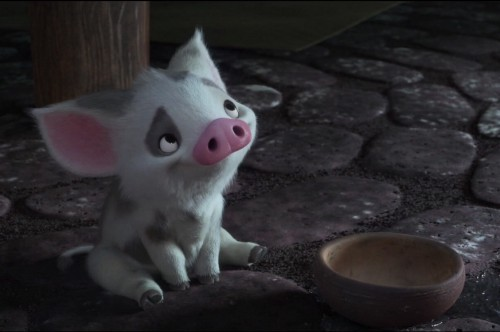

We  live in a time when like all things, visual story-telling and and art  have evolved not just with creative genius as they used to, but also with technology. But even with the advent of animation that represented  the same number of dimensions as the real world, it wasn’t very common to see stories that weren’t merely a 3D mapping of their caricatured 2D versions.

<!--more-->

Perhaps that was the reason why as a child, I was struck by  how real Fiona looked in *Shrek(2001)*. We’ve come very far indeed, and not until I had the chance to watch *The Adventures of Tintin* did I appreciate just how well we could resemble everyday elements on a digital canvas.

While  surreal and fantastical themes expand the realm of imagination,  imitating reality is what causes us to push the boundaries of how well  we can delineate the things we can. After all, reality is far more  complex than anything fictional.

I did not know, though, that I wanted to see nature visualized in that way until I saw Pixar’s *Piper.*

The  2016 short brings innumerable complex textures to life like few others.  The beach, the waves, the rocks, are all rendered from the point of  view of a little sandpiper. The finer details start to weigh out more —  like the innumerable tiny feathers of the hatchling and grains in the  sand — blurring the things we’d normally see on our scale.

*I couldn’t even remember seeing shore sand up that close for real, with broken shells being mixed up with the rock.*

Because they’re so diverse, every grain of sand has been shaped and animated individually. And they reflect off light differently when wet or underwater. The water was no less striking; even though it is a common element, the extended macro shots of the the ripples and bubbles make it believable. They got the lighting amazingly accurate for the foam to look so real.

*Woah, where was that picture taken?*

But it’s not just the rendering that excels at capturing reality. The eyes of the sandpipers were what first made me doubt whether it was indeed a Pixar short. We are used to seeing stories with animals as lead characters with them being anthropomorphised. Not infrequently, even if they are alongside humans they are depicted with whites in their eyes; which is relatable if they can talk, but otherwise makes them a little too expressive. Of course, this is all in favour of the cartoon style that is intended.

*Pua from Moana.*

The sandpipers in *Piper*  on the other hand have real eyes, apart from their feathers and sounds.  They are all they communicate with. With fewer obvious cues, the ones  used are more subtle, making the message effective. It is heartening to  know that recording and adapting sandpipers on the beach and taking out  all the human gestures, the animators turned it into more than just a  story without dialog:

> “One  time I asked the animator to do a head shake for the bird, like a human  saying ‘no.’ And what I appreciated was a note that John [Lasseter]  gave me saying, ‘I know it’s hard, but look for another gesture.’ His  encouragement to keep looking and not going for the easy one, that meant  a lot.” — Alan Barillaro

So  that’s what happens when you don’t take the easy way. Three years for a  6 minute short. Born out of an R&D stage, no wonder it added more  tools to their arsenal; to depict fur, scales, tentacles like you could  reach out and touch them. I’ll be on the look out for where Pixar heads on next.