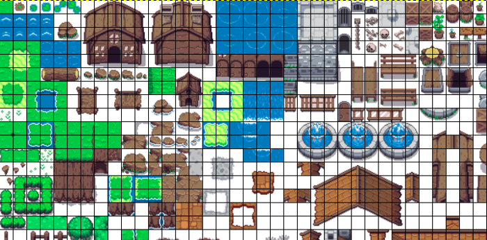
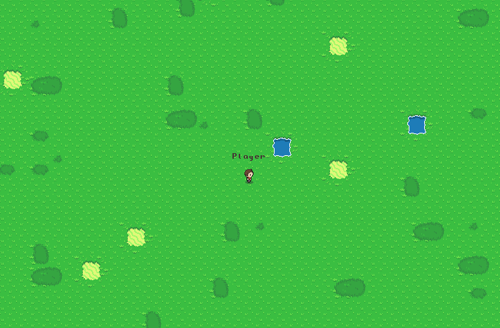
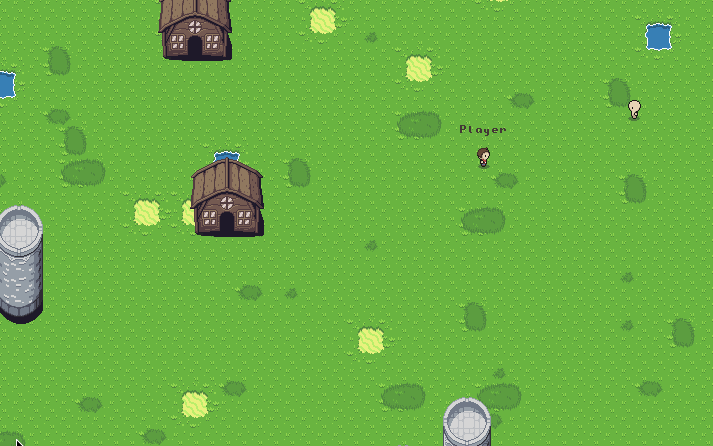

A few days back, I got a chance to be a part of a team to make something at the [Mumbai Hackathon](https://mumbaihackathon.in). Amidst all the more worldly projects, we had decided on making a game. <!--more--> I knew nothing about game-building, and all that was apparent was that you had to take care of more than the usual number of conditions; there’s simply a lot more states that even a simple game can be in. To me, it was intimidating to begin. A little web-based game with nothing  else but JS; we would see what we could come up with.

Fortunately, our teammate had already done some experiments, and we were able to  grasp the basics. With the canvas element, everything was going to be  about manipulating graphics. Being inspired by RPGs, we settled for a 2D map based game, grabbed some sprites off of opengameart.com and got to  work breaking them apart:

Churning out a generic sprite loader to actually use them with the canvas  element was one of the first things that we could do. There would be a  single SpriteLoader object, that would know to do the ground level job  of loading all image files and drawing them (or parts of them) on the  canvas element. The sprites are exhaustive, for every game element that  you can think of. The ones for the maps can be rendered in a variety of  ways in space and time. Using them to their full potential was a distant possibility, but for the time being, we could just stick with what we  needed.

The idea was this, aside from the utility objects, every game element would also be a separate object, with its own state that had things like its  sprite, current position and action. The main game loop would draw a  frame with all the objects repeatedly according to their current state.  The Warrior object for example, with a constant position and action  yeilded something like this.

*It felt good to see our warrior at the centre of the screen*

And now for the exciting part: interaction. For moving him with different  keys, we could define keypress handlers that changed it’s position and  sprite, accordingly.

With that simple idea, it went from cool to mind blowing in like, 5 minutes.

The map, rendered over a larger area, had a 2D array to define it’s  sprites. We populated the array with larger objects at random first, and filled in the the remaining space with single unit grass sprites.

With those in place, we could use them to add more of the environment elements:

*Adding objects, and enemies that move based on the warrior’s position.*

Probably the best part of the project was the arhitecture. Overall, it helped to follow the ‘what an object knows and does’ thinking pattern. Also, it  made it incredibly easy to strip off the boilerplate and focus on the  mechanics. That, along with the hackathon spirit of decision making on  the go; made us cut corners and get things working quickly.

*OOP in action (literally)*

Pretty impressive for something built from the ground up. And all that’s just  the beginning. For starters, socket.io lets us get up and running with  real-time multiplayer mode to get a step closer to [BrowserQuest](http://browserquest.mozilla.org) with just a few lines:

More interactions, combat, quests and realistic maps are all yet to come,  and we’re no longer lost about how we can make them happen.

___

P.S. As we later ruefully discovered, the [Tiled Map Editor](https://www.mapeditor.org/) is a fantastic resource for more intuitively making games and maps.

