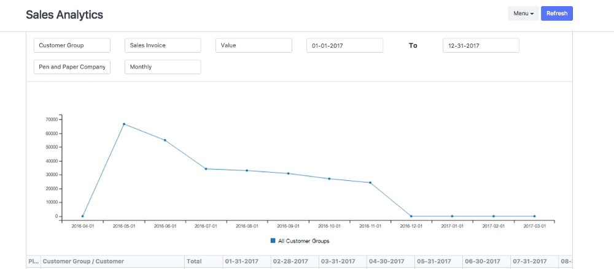
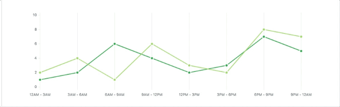
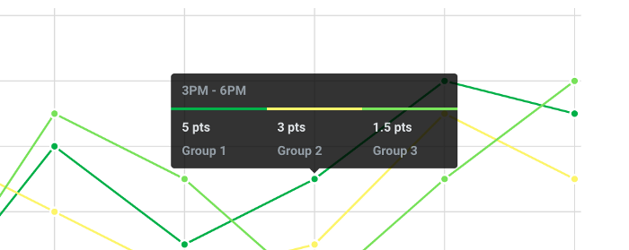
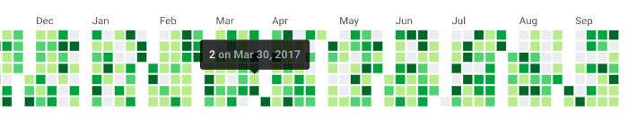
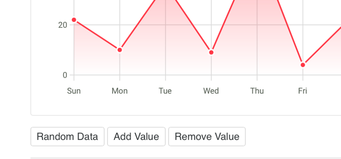

We come across plenty of data scenarios for our ERPNext users. It all  began when we needed them to be able to track sales. It would be nice to  fit in a tiny sales history graph on the user company master of our  product, so we started looking for options. <!--more--> At the time, we were already  using [c3.js](http://c3js.org/?source=post_page---------------------------) for our report pages. However, it didn’t blend very well with our classic design:

*c3 line graphs for timeseries*

As  it were, there weren’t many simplistic JS libraries for a plain graph.  Style patterns are not impossible to override in an existing project,  but this cannot make up for the inherent choices in structure and  behaviour. So instead of configuring a large library to fit our needs,  we took the much straightforward way of designing our own. After all,  our wants were simple; a way to translate value pairs into relative  shapes or positions.

## The design

I found the inspiration to come up with something close to home, right where our projects live. [GitHub](https://github.com/?source=post_page---------------------------)  has it own suite of consistent graphs suited to whatever works best for  its use cases. Despite the assortment, something that immediately  strikes you about all of them is how bare the data points look:

*GitHub commit count history graph*

Less  lines and subtle cues, markers seemingly secondary and only there to  assist; all reducing the clutter. Github knows its audience is at the  page for the trends, and they (the users) don’t expect too many guides.  It knows that on the web, rather than trying to find the exact value by  visually aligning points with a verbose axis, they would prefer to hover  to know the exact data when needed with tooltips.

All that resonated just too well with us, and was our first cue to begin.

## Implementation

We  decided to focus on the essentials needed to get the ball rolling. I  began throwing together some SVG rectangles and lines to come up with a  bar graph.

*Charting: Stage 1*

At this point, the only interesting thing it did was finding the Y 
intervals from the value range and figuring out a good bar width. The 
API needed to get this one going was simple:

In the meantime for our use case, we realised that line graphs were much
better at showing trends, so I added it as an alternative mode. Now, 
aside from the data points, there was a single entity, the *path,* for the entire graph.

*Elastic-linked balls on rods? …*

Updating  values on the chart or any interaction was an opportunity to animate.  Animations, besides being cool, are one of those things that inherently  need you to write modular code. So in case they weren’t already, all the  individual pieces needed to be taken apart:

> “Oh  you want to move that thing around? Too bad you won’t be able to do it  with all those strings attached; you’d have to drag it out as a thing  unto itself first.”

which is great for UI development.

Data  points were easier to do it, but I knew that I’d later on have to  gracefully animate axis lines as well (while making them appear and  disappear depending on whether there were more or less) if there were  changes in the range.

*… Yep*

*The GitHub inspired translucent tooltips deserve a special mention.*

We had use cases of pies as well, but I could simply just go with something much simpler and space-efficient.

*GitHub’s language chart: Parts of a whole, does the job*

*Our percentage chart*

The only thing that still needed [d3.js](https://d3js.org/?source=post_page---------------------------) was our annual heatmap, and [cal-heatmap](https://github.com/wa0x6e/cal-heatmap/blob/master/src/cal-heatmap.js?source=post_page---------------------------),
the library we used for it, was an all in one package. As this one was 
quite static, and I decided to keep discrete and continuous options.

*Traditional Calendar (discrete) view*

*Continuous (like GitHub’s contribution graph)*

That led us to obviate three of our dependencies, reducing the codebase 
by over 330kb. And now we had some decent, responsive stuff and started 
using them in ERPNext.

*First batch*

*Feeling right at home in our reports*

## The Path to Zero-dependency

While  the features had piled up, I had inadvertently dragged in two of the  most goto standards for DOM manipulations and animations: jQuery and the  [Snap API](http://snapsvg.io/?source=post_page---------------------------).  Both of them are fantastic projects and great at what they do, but it  would be nice if I could turn the charts into a library in the future,  so I wanted the project to stay lightweight. Fortunately, it wasn’t too  difficult to figure out life without them. There are several javascript  libraries that are built with no dependencies to dive into the codebase  of, and places like [*you might not need jquery*](http://youmightnotneedjquery.com/?source=post_page---------------------------)  were a great resource to handle the basics in pure JS. For example, the  SVG element attributes are convenient enough, and a writing a simple  function that handled setting those could actually result in better  control:

*Snap vs. custom*

Another  round of focussed purging got those removed, and the code now ran free  from any external dependencies. I could fire it up in a browser and  everything would just work.

Well, except the animations.

CSS3  is convenient for translations, but actual shape morphing (like for the  paths) is trickier for a conventional approach, and there aren’t many [good alternatives](https://css-tricks.com/smil-is-dead-long-live-smil-a-guide-to-alternatives-to-smil-features/?source=post_page---------------------------#article-header-id-3). I discovered [SMIL](https://developer.mozilla.org/en-US/docs/Web/SVG/Element/animate?source=post_page---------------------------)  as the sole contender with decent support, that could morph paths with  equal points, with finer control over easing with beziers. An absolute  bare-bones approach would be to figure out intermediate attribute values  for the best route from one to the next, mapped with respect to the  easing function and rendered with time; an interesting future project.

## Getting it all out the door

While  they were used in ERPNext with real data, I had the chance to break  many of the initial assumptions with edge cases (too many points,  negative values and such) and program for more generic inputs. Once they  seemed stable enough, I went on to set them up as a separate repository  and began packaging.

I realized that designing the landing page would actually take quite some time, and decided to actually do it *before*  completing the project. The page would demonstate the use of the  library, so if possible, I wanted real use cases to drive what the  library could do, rather than the page to be driven by what the library  had. I went ahead and placed all the buttons I’d like to see, whether or  not their function was possible at the time. Thinking from the point of  view of an onlooker made me radically rethink the features.

*Of course we need to be able do these, right?*

With those in place, I went ahead and programmed in the functions that 
were missing. Like physical laws, every new step revealed a bit more of 
the underlying structure and gave a chance for cleaning up. For 
instance, for adding and removing values, updating values had to be 
upgraded to take in a different number of points than the current set. I
also tried to let the user have more control over the rendering, but in
a way that keeps the design consistent.

*A Trends Chart: That’s just a line chart with many values, no data dots,
series-skipped X values, horizontal instead of vertical lines and a 
gradient instead of solid color, all hackable through the API*

Finally  all seemed well, and we went ahead and released them out into the wild.  We have been fortunate enough to receive an amazing response from the  open source community over a short span of time, and got to be a part of  many interesting [discussions](https://news.ycombinator.com/item?id=15594004&source=post_page---------------------------). We’ve also had some [awesome contributions](https://github.com/frappe/charts/pulls?q=is%3Apr is%3Aclosed&source=post_page---------------------------) (including a pie chart!) and [ideas](https://github.com/frappe/charts/issues?source=post_page---------------------------)  for more features. There’s still plenty of room for improvement, and  I’ll continue working to make them better, following which we’ll look  forward to release the next upgrade to features. Be sure to keep a  lookout for what Frappé comes up with next!

------

[*Frappé Charts*](http://frappe.io/charts?source=post_page---------------------------) *are on* [*GitHub*](https://github.com/frappe/charts?source=post_page---------------------------)*. Give them a spin and let us know what you think; we’d love to hear your feedback :)*

*P.S.:  This is my first library, and I am grateful to everyone at Frappé for  the opportunity and support to work on it (Is this what they call R&D? ;) )*

