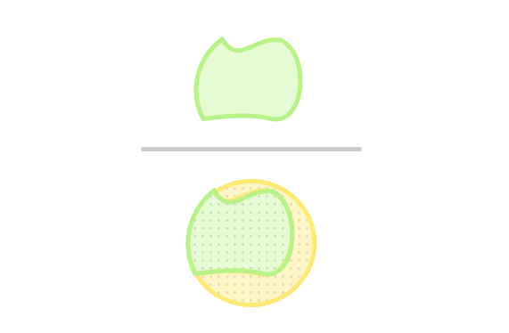

*Some thoughts/aids/ideas that helped me understand some of the concepts like fundamental to so many things in Information Retrieval, as well as other areas.*

<!--more-->

So you're a Search System. Everything you know is comprised in a Library of Knowledge full of scrolls and docs

and your job is to find and give Seekers what they need based on what they tell you.

You have a knack for finding things, and for doing what you're told, so you imagine that for any *need of knowledge* that they might have, If your docs-world has the truth, in these docs, you'll find and guide them to the Truth and nothing else.

In an ideal, rainbows-and-unicorns world.

Unfortunately for you, there is an interface the user's need has to pass through before reaches you: which is *how well they can express their thoughts*.

All you can get is a ***query***, an rough idea, of what their need is. With that, you have to guess your best to divide your docs world into what you *think* is correct and not. 

And given how far off the query was from the need, your guess might be ... well, a bit patchy.

You decide to find at least know just how far off you really are, rather than leaving everything upto chance, so you can maybe find tricks to do better. 

## The Elusive Truth

But just *how* far your guess is from the real deal? You notice three main areas

- **The Extra Part**: in the guess, it has things added that <u>should not</u> have

- **The Missed Part**: in the truth, which are things removed/not selected that <u>should</u> have

And then of course,

- **The Correct Part**: the one Both have, things that should have been added and are added, the correct/good part, where both are same --> the green part.

## The Dilemma

There seem to be two ways to correct the error then. You don't have control on the real part, just on the guess. So, you can,

- grow the guess: absorb more of the Missed

- reduce the guess: reduce some of the Extra

But this can't be done without a Seeker's help.

So the next seeker that comes up to you and states his need, you give the docs and ask,

You: "Hey, so any thoughts about the results?"

Seeker: "Yeah they're nice, though there are some wrong docs in here too."

You: "I can think of a way to imporve them maybe. Could you try to be more specific, and maybe remove some words?"

.png)

Seeker: "Yeah now *all* of these seem fine, there's no wrong ones, and looks like there are quite a few missing"

You: "Well, what if you added more words and were more general?"

.png)

"Yeah now there's everything I wanted, what are all these other things?"

Hmm.

It seems there are two very different ways of *doing well*, each of which is good in one way, but bad in another.

And, you realize, unless the **initial offset** between query and need is cured, or you're *very* lucky, you're never going to do well on both.

## The Types of Goodnesses

So it seems you need to track both these cases of your searches. 

Two points strike you that might be good pointers:

**Quantity**: How well you were able to catch everything. It shows you *correct* things *removed* mistakenly.

That would basically be *your catch* vs *everything correct*.

That is, **your correct guess ÷ truth**

The other one is **Quality**: How well did you avoid being wrong. It shows *wrong* things *added* mistakenly.

Which would be *your catch* vs *everything you got* 

That is, **your correct guess ÷ guess** 

Not bad. The only trouble now is that you're having some difficulty measuring all those areas.

## "Finding things" is everywhere

To fix the squiggly shape area problem, you dumb it down removing unnecessary details, that makes it easier.

Hang on. This looks familiar.

It look just like something your friend, who is an **Object Detection System**, does.

You're quite excited and show it to her. She's very interested, but then points out that it's actually not surprising, and in fact your measures are real and actually have names:

- Measuring Quality is usually called ***Precision***: So for her, how well her guess catches *only* the object.

- Measuring Quantity is on the other hand called ***Recall***: How well her guess gets *all* of the object

What's more, there are even more names. The extra part, for example is called a *False Postive*. The missed part on the other hand is called a *False Negative*. And the correctly guessed part is called a *True Positive*.

Woah, that's neat.

You start to ask her how does *she* measure them, but them remember that she really just has all the box widths and pixel values which are pretty convenient.

But your corpus and guesses do not have any apparent shape ...

... which actually might be a good thing. Maybe you don't even have to stop at this box shape.

## The Proportions

You keep trying things out, and then something hits you.

Maybe there's no real reason for the guess and real blobs to be in the middle. (And let's just increase the sizes so they're easier to work with)

Ah, now everything is proportional to the big Docs Box. That should make measuring things a bit easier.

So Precision and Recall would now look like,

Working with proportions seems pretty convenient.

Say if there are 10% true docs, then we don't have to know the actual number of docs.

Also, you had heard somewhere that percents can be thought of as measuring the chance, or "probability".

So if you just got 1 doc from the entire store, it would have a 10% chance of being correct.

To put in an another way, **P(was true) = 10%**

You decide to go even further. To see what happens when you guess.

Say the Seeker gives you a query, and 70% of correct docs satify it, along with 5% of the incorrect ones.

This means you know you got 70% of correct ones. 

It sounds very familiar ... wait isn't that just Recall? 

Also, 70% of correct ones is also just another way to say *the chance that a doc was guessed, given it was true (limiting ourself to just true docs), is 70%.*

That is, **P(doc_was_got | doc_was_true) = 70%**

Which means, all of these are equivalent:

So we have had our Recall with just proportions or rather, probabilities.

Can we do precision too in a similar way?

## The Bayes Case

Precision looks like it is very similar. The correct docs (green part) are still in the focus, but here you compare it with respect to the ***guess*** (yellow) part rather than the true part.

So looks like here Precision would also be a probability, but a flipped one; it would say: "Given you got a doc, what is the chance it was true?",

Which is **P(doc_was_true | doc_was got)**

But for that you need the areas of the green and yellow. Not a problem, you can find them with the percents you know.

This means Precision is,

Oh, but wait.

We already know that the 

- 10% is **P(doc_was true_)**

- 70% is **P(doc_was_got | doc_was true)**

In the same way, 

- 90% is **P(doc_was_not_true)**

- 2% is **P(doc_was_got | doc_was_not_true)**

Also, that denominator is just the entire guess, which is **P(doc_was_got)**

And so, you find Precision to be, 

Woo! Can't wait to show this interpretation your friend, bet she hasn't seen this one before.

--

You slowly begin to realize that whatever are any of those docs, even if you don't know their exact count, just a rough ratio, or a chance how many they might be, you *still* have a way to know how good we'll be.

Of course, everything still much upto chance. But something hits different.

It's like you now know exactly just how much that chance is :)

## Credits

**Concepts**: Information Retrieval (IR) by Chris Manning, Bayes Theorem by 3Blue1Brown

**Style**: Lauren Ipsum, Wait But Why, Vihart, Advent of Code, HPMoR

**Based On**: Precision and Recall as relevance measures in Search, and the Probabilistic approach to IR 
