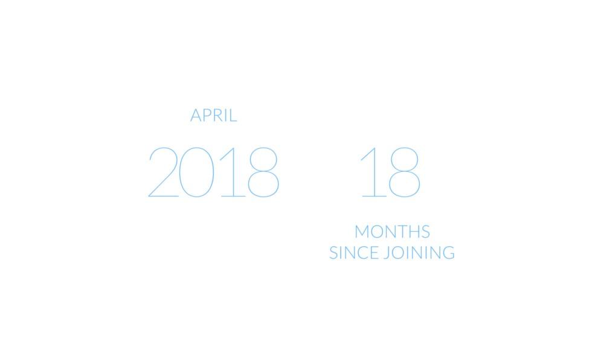
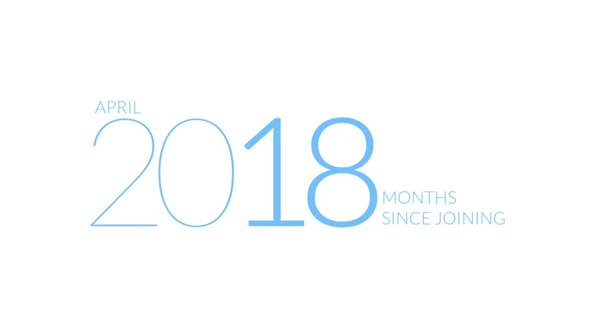
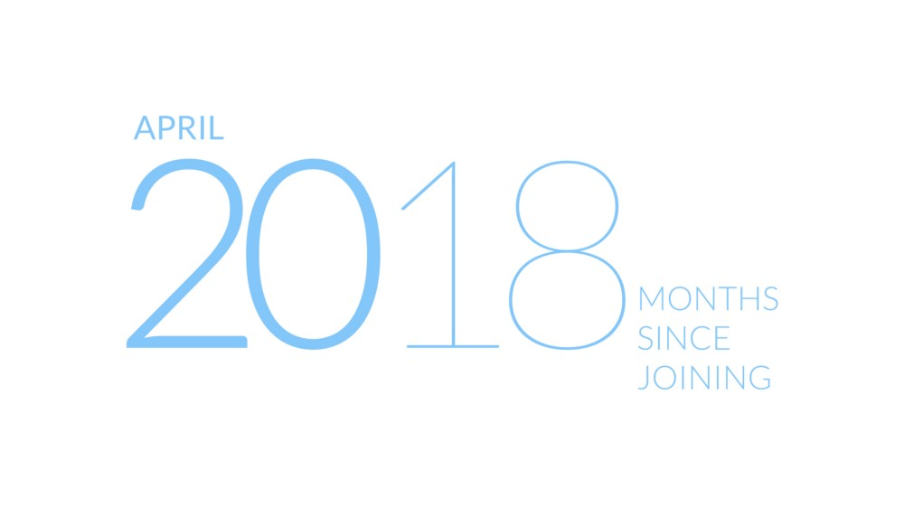
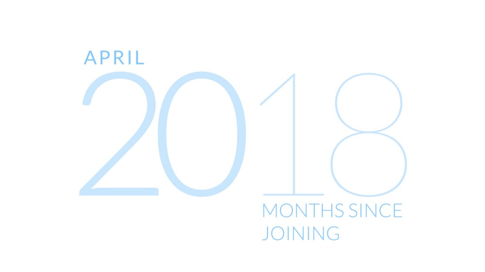
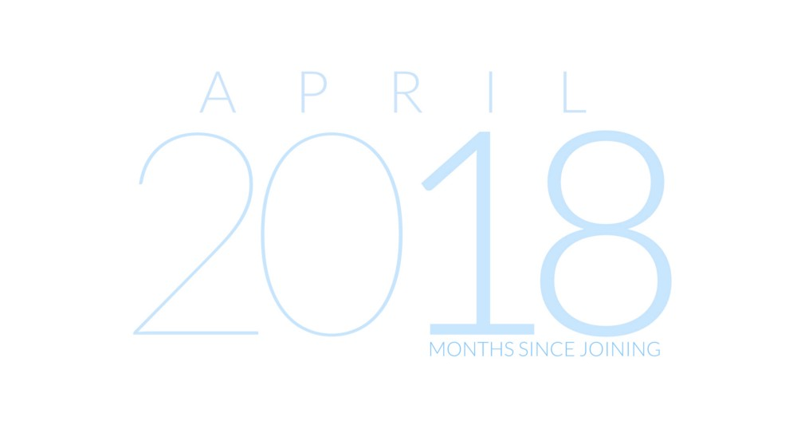

Getting around to make a good Open Day title slide is no ordinary feat. Sometimes it’s drab, and sometimes you just get lucky. Here’s a tiny story.

<!--more-->

The April ‘18 Open Day, which incidentally was my 18’th month at the company. Hmm, can we chain them?

The massive ‘2018’ could use a bit less prominence.

Not that less >.< Let’s try making the ‘20' bold with the small word April.

A bit better, maybe not flat down on the floor for weight distribution. Let’s see how we can place this.

Too hanging?

Woah, much better. Why does April have to be in a corner then? Oh, if we center it, what will be it’s font weight?

Mmm, clever, but looks like thin weight would be fine. Also, now that April has found its place, ‘20’ no longer needs to be the bolder one.

Nice. Everything is so connected. Except perhaps ‘April’. Can we do better?

That’s a start. Similar ‘April’ line width as the ‘20’. Let’s go a step further and prove it.

At last! Now every piece just feels a part of the same story :)

---

To be fair, no sample was in any way inferior to any other. What is interesting is always the process. The way we transition from one iteration to the next is really where all the fun stuff happens.

Will there be any more? We’ll have to wait to see :)

