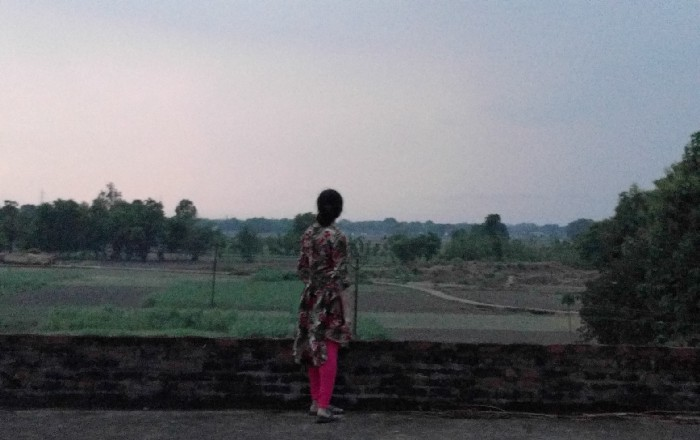

Trips to our native place in Varanasi have long ceased to be the annual summer visits that they used to be during my school days. Especially for me, they are fewer and farther between than for my parents. This year however, mother and I decided to go for a week’s stay.
<!--more-->

Exploration doesn’t wait further than the doorstep to begin. Our house there was built during my grandfather’s time. I can never help but marvel at the width of the walls, to allow for all the roshandaans and pillars; so much that when I was little I would always doubt the strength of single brick-width constructions. With plenty of rooms, there is always so much to see, like whether the ones not reserved as living spaces house grains or equipment. And since things always change since our last visit, I could never be sure what I’d find behind a closed door.

*The courtyard*

The  terrace was the second best place for a stroll, after the fields, where  one felt even more close to the sky in the open landscape. It was  divine for bedtime though, especially during the summer months. And you  had the rare chance when you get to see the stars clearly, with no light  pollution to block the view. There is nothing like falling asleep to  the sight of the them.

A  few days were past when it had started to turn cloudy; a glad sight,  for the ongoing period was a gap between showers, the most hot and  humid. Of course, that wasn’t the real reason for feeling elated, it was  this:

You could just capture clouds all day, and they’d all turn out to be 
wallpapers. In remote places without much pollution, they seem to freely
descend even lower, and you can appreciate their granularity. And the 
diffused daylight made even previously visited places look new:

*Looks like a pagdandi, no one there could tell where this was from*

And then one day it did rain. Characteristically, in places with vast 
fields and open spaces, precipitation generally first sends forth high 
winds and dust clouds. (the perfect time to quickly gather any mangoes 
that fall in the orchard). We were out when it began and everything had 
started to turn sepia.

*Waves in the rice nursery*

Turbulent  rains followed (making up for dissapointment of having to leave Mumbai  right after the first showers), the culmination of how good everything  could get. Rambling along the field lanes, we had the fragrant soil, the  fresh leaves and the cold to accompany us. Then it was the terrace  again for the rest of the day.

And once it started to get dark, I couldn’t resist trying to catch a lightning strike.

*6th attempt, video; no long exposure resources on hand*

It  wasn’t just the way of living that changes there. Even without the  architecture to augment it, the place itself feels like being in another  time; evolving with all its developments, but constant nonetheless.

But then one can always wonder: *It must be so hard to live in a remote place like this.*

Looking out to the horizon, I’m not very sure it is.