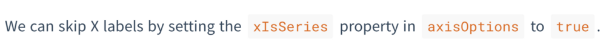

So you’re me and you’re a software dev, and you’re faced with the ultimate task of finally getting around to writing documentation.
<!--more-->

You remember the time when you thought it’s not really important to document things if you write computer programs well. You would gloss over your tiny functions, and take pride in always writing readable code (as you assumed), thought-out variable names, and think surely no one will have trouble understanding what you obviously mean.


Of course, you feel you’ve gotten past those delusions. [Intent of the code](https://signalvnoise.com/posts/3250-clarity-over-brevity-in-variable-and-method-names?source=post_page---------------------------)  that makes the reader feel like having Matrix-y  see-past-the-code-vision, while necessary, isn’t sufficient. Even  leaving the end users aside, your future self too may want to come back  and make changes. You suddenly start to empathise with them and get to  work.

You start with one of your independent projects to kickstart things and to get into the habit of it.


## The Humane Way: Writing

To get a taste of what’s ahead, you go with your most used strategy: examples. Instead of reading on *how* to write docs, you spend hours to read up some great docs examples.

You  discover that documentation is one of those technical places that  doesn’t feel mechanical. The Python Community looks like it has always  managed to be human *and* professional (despite being open source, that says a lot about discipline); [Flask](http://flask.pocoo.org/?source=post_page---------------------------), [Requests](http://docs.python-requests.org/en/master/?source=post_page---------------------------), [The Hitchhiker’s Guide to Python](http://docs.python-guide.org/en/latest?source=post_page---------------------------) itself. Engaging writing style doesn’t even begin to describe them. The folks over at [Write the Docs](http://www.writethedocs.org/guide/writing/beginners-guide-to-docs/?source=post_page---------------------------#what-to-write) are a great resource for how to write docs … while demonstrating it themselves. [Bootstrap](https://getbootstrap.com/docs/4.1/content/reboot/?source=post_page---------------------------) and [Vue](https://vuejs.org/v2/guide/?source=post_page---------------------------) are amazing projects that use use-cases to clarify the intent of their decisions. [Yarn](https://yarnpkg.com/en/docs?source=post_page---------------------------), on the other hand, is a good example of to-the-point reference of all it has to offer. In the realm of small utilities, [BlissfulJs](http://blissfuljs.com/docs.html?source=post_page---------------------------) is a fresh one to capture attention on how it eases your use of native Javascript.

After all that imbibing, you allow yourself some time to begin composing. To quote Mr. Holmes:

> A  man should be at his very best and keenest for such nice work as that,  and I did not wish to do it when fagged by [tediousness].

You  imagine your README as a summary of the stuff you’d like to cover. That  means you’ve gotten things like ‘Installation’, ‘Get Started’ and  ‘Configuration’ down. So now it’s about the real meat, the API in depth.  But it’s already been too late to follow RDD and for all of [Kenneth’s talks](https://www.kennethreitz.org/documentation-is-king/?source=post_page---------------------------), you’re here to start them after coding stuff in.

You get down a basic structure for each concept something like:

- What is it / Concept
- Use case / idea / what it is built upon
- How to use it
- What it does/shows [Example]
- Any modifications

Out of which the technical bits from usage to modifications are easy enough:


But the explanation you write turns out to be a … well …


*Ya don’t say.*

[Hmm.](https://signalvnoise.com/posts/454-why-most-copywriting-on-the-web-sucks?source=post_page---------------------------)

Just listing each idea this way reminds you of the index at the back of the book, useful in a cheatsheet way. In fact, you *have* seen a section in the docs that incorporates these: it’s called an *API reference*. There must be a reason they’re called a reference.

The full-fledged explanation though, looks like it lacks motivation.

Instead, you try and write it with some context:


Progress!

As you document more and more stuff, you’ve started to like *redundancy*,  linking docs all over with property keywords and “as we have seen’s”.  In fact, you even add a couple of other optional items to the list:

- Relations
- Gotchas

And while you’re at it, you decide to show them stuff they’ll actually use:
forget list outs, we’re here for the stuff we can do.


*[Solved][Feature Request] Stacked Bar Charts*


## The Medium: Markdown

You  decide that content needs a simple medium in plain text, even though  all of it has to be converted to HTML in the end. While writing plain  HTML is great — after all, HTML has evolved to give meaning to content —  you still feel it’s the stage I of reducing complexity. Markdown looks  like one such option, with minimum notations to decide the semantics, so  that your text is easily translatable to HTML. Also, given that most of  the existing documentation of your system exists in markdown, it makes  it a consistent choice.


## The Interactivity: Demos

You  feel you’ve made a fantastic choice to put in a CodePen demo on the  landing page. Unfortunately, that makes you get bored soon with your  static examples. They sure are indispensable to get your point across.  But you remember being blown away by a website that taught you [web design in 4 minutes](https://jgthms.com/web-design-in-4-minutes/?source=post_page---------------------------), that engaged you while showing you the instant effect of certain actions.

Since your medium is the web, you’d like to make things more interesting than the back of a cereal box.

So you go ahead and add this:


Given  the sheer number of demos you’d have to create, you only wish you had  something that rolls out a demo with the desired configuration.

Fortunately, your project is from the remarkable species of JavaScript libs, that is used as:


```js
new LibObj (parent, options)
```


and most of the options are primitive values. It doesn’t take much code 
to come up with something that given an option type and values, creates a
control to take input and creates an object with the value passed. 
Moreover, it can also have actions:


Only,  this leaves you with a dilemma about the location of storing the demo  configuration. The whole point is to keep .md files static, so simply  having the config where the demo would be in the markdown itself is a  fantasy.

Or is it?

After all, configuration itself is static. You discover [Vue components](https://vuejs.org/v2/guide/components.html?source=post_page---------------------------) (incidentally, one of the [most heavenly examples of docs](https://vuejs.org/v2/guide/?source=post_page---------------------------) you’ve ever read), that allow custom configured elements in HTML. And as Vue allows for [deferred mounting](https://vuejs.org/v2/api/?source=post_page---------------------------#vm-mount), it is easy enough to include it in any post process of your documentation generator.

With some effort, you’re able to come up with this:


*Demos in markdown: the combo that for one wild moment makes you feel you’ve reached the pinnacle of configuration over code. O Holy.*


You almost feel like this is something markdown should have by default, but think better (or worse) of it.

Hurray for interactivity! But when you try it with the remaining values it … fails?

All this demoing is leading you to bugs you didn’t even know you had. Integration testing, yay.


## The Framework: Maintainability

So  far your goal has been to keep docs themselves as portable as possible.  The next step is the future case of bootstrapping a documentation  framework. After going through an [old thread](https://news.ycombinator.com/item?id=11164013&source=post_page---------------------------), you decide to explore some of the widely used options today.

Three things are on your mind the most: Pre-rendering, search, and layout modification.

You’ve had some experience with [GitBook](https://docs.gitbook.com/?source=post_page---------------------------) and Docsify. GitBook  has for long been the professional choice, which means it has a slew of  features, but also limited options to customise the standard layout  decisions.

[Docsify](https://docsify.js.org/?source=post_page---------------------------#/)  is a more take-apart project, has no statically generated HTML files,  which while making it lightweight, compromises overall SEO. But for  simple projects, it is a great option with regards to customizability  with plugins and layouts (The community has been considerate enough to  release [many add-ons](https://docsify.js.org/?source=post_page---------------------------#/plugins?id=list-of-plugins) that people might need while writing docs).

GitBook and [Vuepress](https://vuepress.vuejs.org/guide/?source=post_page---------------------------#how-it-works) being large-scale projects, have the Algolia search API usage built-in, making it easier to incorporate indexed search.

Vuepress aims to [alleviate](https://vuepress.vuejs.org/guide/?source=post_page---------------------------#why-not)  most of the issues in the above. However, being a relatively new  project, some of the features are still in development. Yet, its  gameplan looks promising if one wishes to design and customize a system  that suits plenty of existing and forthcoming projects.


## Release: The Beginning

Of  course, after the first write-through, things still look messy. But now  you have wood to work on, some protocols that’ll help you add things  and maintain better. You’ve started to like it, to sleep better, and  wonder how the project managed to survive until now without it.

You  realise that it makes little sense to berate people for not being  motivated enough to read the source code; the ultimate holy grail of  developers is to communicate their work to other *makers*,  whose work may or may not involve programming itself. That’s the  wonderful thing about code, the highly accessible (when made so!) form  of tinkering, that permeates all walks of life.

You publish out the docs, hoping that your users end up understanding a lot more about the project than you ever did.


*The result, as the first draft:* [*https://frappe.io/charts*](https://frappe.io/charts?source=post_page---------------------------)

*Thank you* [*Vihart*](https://www.youtube.com/watch?v=ahXIMUkSXX0&source=post_page---------------------------)  *for being an inspiration for the narration style. And for programming,  math, drawing, music, presentation … strike that, almost everything.  You’re diabolically awesome.*


